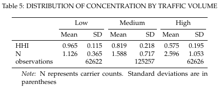
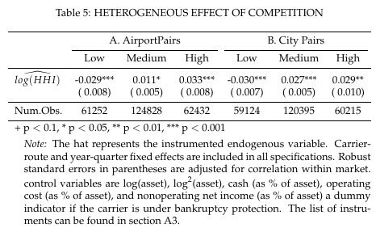

### Tables

  
  

  
  

  
  

### Table 2

### Table 3

- For table 3, we need to manually type "threetable" on latex file in order to make such a long footnote.

### Table 4

### Table 5

### Table 6

